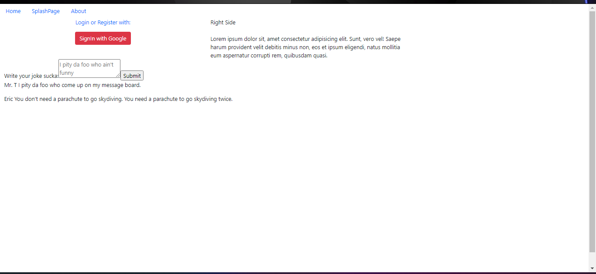
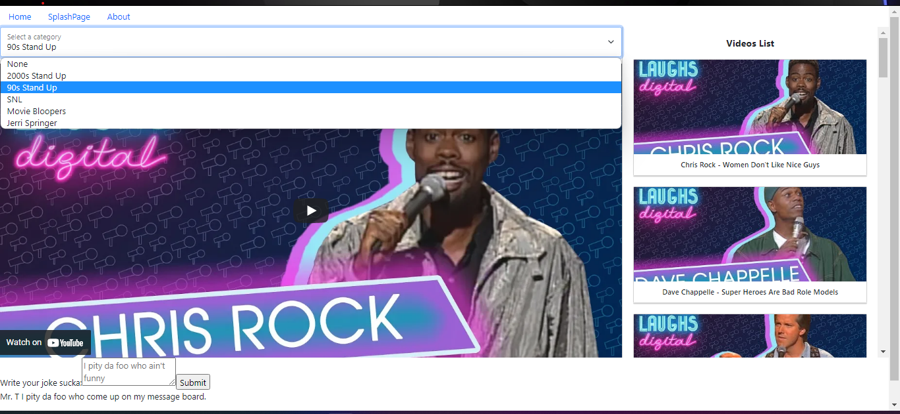
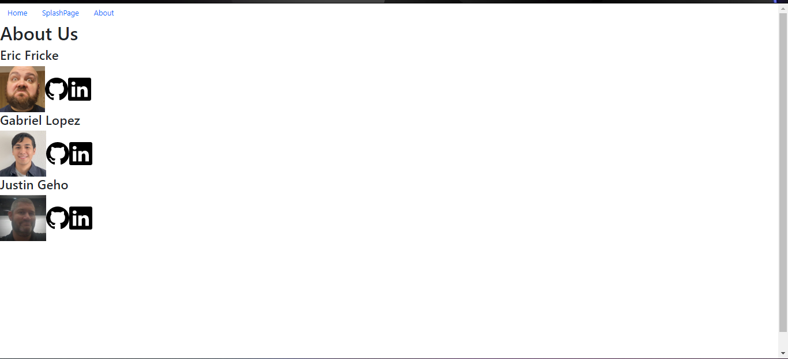

# LaffBox TV

## Overview
This is a full-stack application that allows visitors to search for several types of comedy on the web. 

## Developers
- Eric Fricke (Omaha, NE)   
- Gabriel Lopez (Houston, TX)   
- Justin Geho (Atlanta, GA)   

## Site Use Instructions:
- Sign in using OAuth for your Google account
- Once redirected to the Homepage, 1. Select from the dropdown to seach comedy videos AND/OR 2. Write a joke or comment on our message board
- Play your selected video, select a new video or search for a new category
- Visit our About Us page to view our GitHub and LinkedIn pages

## API Docs
https://developers.google.com/youtube/v3/docs

## Deployment

Back-End: https://afternoon-stream-01263.herokuapp.com/  
Front-End: https://laughbox-app.herokuapp.com/

## Technologies/Concepts
- HTML/CSS/Bootstrap
- JavaScript
- React (Functional and Class Components, React-Bootstrap)
- Node/Express
- PostgreSQL

## Screenshots:
Early concept non-styled Splash Page &nbsp; &nbsp; &nbsp; &nbsp; Finished Splash Page 

 
Early concept Home Page &nbsp; &nbsp; &nbsp; &nbsp; &nbsp; &nbsp; &nbsp; &nbsp; &nbsp; &nbsp; &nbsp; &nbsp; &nbsp; &nbsp; Finished Home Page  

 
Early About Page &nbsp; &nbsp; &nbsp; &nbsp; &nbsp; &nbsp; &nbsp; &nbsp; &nbsp; &nbsp; &nbsp; &nbsp; &nbsp; &nbsp; &nbsp; &nbsp; &nbsp; &nbsp; &nbsp; &nbsp; &nbsp; Finished About Page 

 
